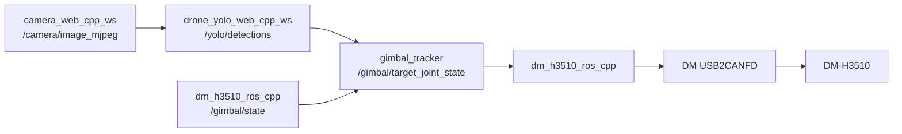

# DM-H3510 ROS2 工作区

这个工作区是 RK3576 上的云台主入口。你用它启动 DM-H3510 驱动，也用它运行 YOLO 跟踪云台。

推荐主线是 C++ 版本。Python 版本保留为备用验证版本。

下面的 Windows 命令默认从 RK3576 项目目录执行。

## 5 分钟跑通

先部署，再构建 C++ 工作区：

```powershell
cd .\dm_h3510_ros_ws
.\scripts\windows\deploy_to_board.ps1
adb shell "bash /home/lckfb/workspace/dm_h3510_ros_ws/scripts/board/build_cpp_ros.sh"
```

启动云台驱动：

```powershell
adb shell "bash /home/lckfb/workspace/dm_h3510_ros_ws/scripts/board/run_cpp_ros.sh"
```

另开终端，确认云台反馈：

```powershell
adb shell "source /opt/ros/jazzy/setup.bash && source /home/lckfb/workspace/dm_h3510_ros_ws/cpp/install/setup.bash && ros2 topic echo /gimbal/state --once"
```

确认 YOLO 已发布检测：

```powershell
adb shell "source /opt/ros/jazzy/setup.bash && source /home/lckfb/workspace/drone_yolo_web_cpp_ws/install/setup.bash && ros2 topic echo /yolo/detections --once"
```

先 dry-run 运行跟踪器：

```powershell
adb shell "DRY_RUN=true bash /home/lckfb/workspace/dm_h3510_ros_ws/scripts/board/run_gimbal_tracker.sh"
```

确认方向正确后，再真实控制云台：

```powershell
adb shell "DRY_RUN=false bash /home/lckfb/workspace/dm_h3510_ros_ws/scripts/board/run_gimbal_tracker.sh"
```

## 核心流程



`gimbal_tracker` 同时需要 `/yolo/detections` 和 `/gimbal/state`。缺任意一路，它都不会输出真实目标。

## 目录说明

| 路径 | 作用 |
| --- | --- |
| `cpp/` | C++ ROS2 工作区。当前推荐主线 |
| `python/` | Python ROS2 工作区。保留为备用验证 |
| `scripts/windows/` | Windows 侧部署脚本 |
| `scripts/board/` | RK3576 板端构建、运行、发布目标脚本 |
| `docs/yolo_gimbal_quickstart.md` | YOLO 和云台联调步骤 |
| `docs/troubleshooting.md` | 常见问题排查 |

## 工作区边界

| 工作区 | 职责 |
| --- | --- |
| `dm_h3510_ros_ws` | DM-H3510 驱动、YOLO 跟踪节点、部署和板端构建 |
| `gimbal_dm_h3510_ws` | PC 烟测、USB2CANFD 验证、资料归档 |
| `camera_web_cpp_ws` | 摄像头 MJPEG 和 ROS 图像 |
| `drone_yolo_web_cpp_ws` | 无人机检测和 `/yolo/detections` |

不要把驱动代码合并到视觉工作区。视觉工作区只负责检测。

## 当前硬件链路

```text
RK3576 USB -> DM USB2CANFD -> Classic CAN 1 Mbps -> DM-H3510
```

当前实现使用达妙 `DM_DeviceSDK` 的 Linux arm64 用户态库 `libdm_device.so`。

不走 `gs_usb/can0`。当前板端内核 `6.1.99` 无法直接加载资料里的 `gs_usb.ko`。

## 当前控制模式

当前 C++ ROS 节点使用 `speed mode + software position loop`。

上层仍然发布输出端目标角度。驱动内部根据目标角和 `/gimbal/state` 的连续角度反馈，计算速度命令。

```text
CAN ID: 0x201 = 0x001 + 0x200
payload: float32 velocity_rad_s
byte order: little-endian
feedback ID: 0x011
```

ROS 话题统一使用云台输出端单位。驱动内部按 `35:1` 谐波减速器换算到电机端。

```text
电机速度命令 = 云台输出速度命令 * 35
电机速度 = 云台输出速度 * 35
云台输出角度 = 电机展开后的连续反馈角度 / 35
云台输出速度 = 电机反馈速度 / 35
```

旧的 position-speed cascade 命令只能覆盖电机端单圈范围。装 `35:1` 减速器后，输出端可达范围太小。

```text
电机反馈单圈范围: -12.5 ~ +12.5 rad
输出端单圈反馈范围: -12.5 / 35 ~ +12.5 / 35
速度模式通过连续反馈展开和软件位置环支持多圈目标。
```

## ROS 接口

| 节点 | 方向 | 名称 | 类型 | 说明 |
| --- | --- | --- | --- | --- |
| `dm_h3510_ros_cpp_node` | 订阅 | `/gimbal/position_cmd` | `std_msgs/msg/Float32` | 云台输出端目标位置，单位 rad |
| `dm_h3510_ros_cpp_node` | 订阅 | `/gimbal/target_joint_state` | `sensor_msgs/msg/JointState` | `position[0]` 是输出端目标位置，`velocity[0]` 是输出端速度限制 |
| `dm_h3510_ros_cpp_node` | 发布 | `/gimbal/state` | `sensor_msgs/msg/JointState` | 云台输出端位置、速度、力矩反馈 |
| `gimbal_tracker_node` | 订阅 | `/yolo/detections` | `vision_msgs/msg/Detection2DArray` | YOLO 检测框 |
| `gimbal_tracker_node` | 订阅 | `/gimbal/state` | `sensor_msgs/msg/JointState` | 当前 yaw |
| `gimbal_tracker_node` | 发布 | `/gimbal/target_joint_state` | `sensor_msgs/msg/JointState` | 跟踪目标角度 |

## 参数文件

| 功能 | Windows 源码路径 |
| --- | --- |
| C++ 云台驱动 | `cpp/src/dm_h3510_ros_cpp/config/dm_h3510_ros_cpp.yaml` |
| YOLO 跟踪云台 | `cpp/src/gimbal_tracker/config/gimbal_tracker.yaml` |
| Python 云台驱动 | `python/src/dm_h3510_ros_py/config/dm_h3510_ros_py.yaml` |

`gimbal_tracker` 当前关键参数：

```yaml
min_yaw_rad: -6.2832
max_yaw_rad: 6.2832
velocity_rad_s: 0.3
deadband_px: 40.0
kp_x: -0.0008
max_step_rad: 0.03
dry_run: true
```

云台驱动当前减速器参数：

```yaml
motor:
  gear_ratio: 35.0
  gear_direction: 1.0
  velocity_id_offset: 512
position_loop:
  kp: 2.0
  tolerance_rad: 0.02
```

修改参数后必须重新部署和构建：

```powershell
cd .\dm_h3510_ros_ws
.\scripts\windows\deploy_to_board.ps1
adb shell "bash /home/lckfb/workspace/dm_h3510_ros_ws/scripts/board/build_cpp_ros.sh"
```

## 文档入口

| 你要做什么 | 看哪个文档 |
| --- | --- |
| 从零跑 YOLO 跟踪云台 | `docs/yolo_gimbal_quickstart.md` |
| 排查没有反馈、没有检测、参数不生效 | `docs/troubleshooting.md` |
| 查看 C++ 驱动协议和运行方式 | `cpp/README.md` |
| 修改 `gimbal_tracker` 参数 | `cpp/src/gimbal_tracker/README.md` |
| 使用 Python 备用版本 | `python/README.md` |

## 常用命令

查看节点：

```powershell
adb shell "source /opt/ros/jazzy/setup.bash && ros2 node list"
```

查看话题：

```powershell
adb shell "source /opt/ros/jazzy/setup.bash && ros2 topic list"
```

发送单次位置目标：

```powershell
adb shell "bash /home/lckfb/workspace/dm_h3510_ros_ws/scripts/board/pub_position_once.sh 0.5 0.5"
```

这个命令表示输出端转到 `0.5 rad`，输出端速度限制 `0.5 rad/s`。

查看 tracker 安装配置：

```powershell
adb shell "cat /home/lckfb/workspace/dm_h3510_ros_ws/cpp/install/gimbal_tracker/share/gimbal_tracker/config/gimbal_tracker.yaml"
```
