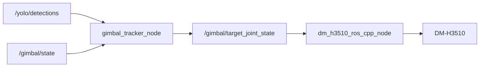

# gimbal_tracker 参数手册

`gimbal_tracker` 把无人机检测框转换为云台 yaw 目标角度。

它不会直接控制 CAN。它只发布 `/gimbal/target_joint_state`，由 `dm_h3510_ros_cpp_node` 驱动云台。

## 数据流



## 安全原则

默认用 `dry_run: true`。这时节点只打印计算结果，不发布控制目标。

确认方向、角度、速度都合理后，再使用 `DRY_RUN=false`。

## 参数位置

Windows 源码参数：

```text
.\dm_h3510_ros_ws\cpp\src\gimbal_tracker\config\gimbal_tracker.yaml
```

板端源码参数：

```text
/home/lckfb/workspace/dm_h3510_ros_ws/cpp/src/gimbal_tracker/config/gimbal_tracker.yaml
```

板端安装后运行参数：

```text
/home/lckfb/workspace/dm_h3510_ros_ws/cpp/install/gimbal_tracker/share/gimbal_tracker/config/gimbal_tracker.yaml
```

## 当前推荐值

```yaml
target_class: drone
min_confidence: 0.60
image_width: 640.0
image_height: 480.0
deadband_px: 40.0
kp_x: -0.0008
max_step_rad: 0.03
min_yaw_rad: -6.2832
max_yaw_rad: 6.2832
velocity_rad_s: 0.3
control_rate_hz: 10
lost_timeout_s: 0.5
dry_run: true
```

## 参数表

| 参数 | 当前值 | 作用 | 什么时候调大 | 什么时候调小 |
| --- | --- | --- | --- | --- |
| `target_class` | `drone` | 跟踪的检测类别 | 类别名变了 | 不需要调小 |
| `min_confidence` | `0.60` | 最低置信度 | 误检多 | 漏检多 |
| `deadband_px` | `40.0` | 中心死区 | 中心附近抖动 | 跟踪太迟钝 |
| `kp_x` | `-0.0008` | 像素误差到 yaw 增量的比例和方向 | 跟得慢 | 来回摆动 |
| `max_step_rad` | `0.03` | 每次最大角度增量 | 单次动作太小 | 动作太猛 |
| `min_yaw_rad` | `-6.2832` | 最小 yaw | 左侧范围不够 | 机械范围不足 |
| `max_yaw_rad` | `6.2832` | 最大 yaw | 右侧范围不够 | 机械范围不足 |
| `velocity_rad_s` | `0.3` | 驱动层速度限制 | 电机转得慢 | 电机动作太快 |
| `control_rate_hz` | `10` | 控制频率 | 输出不够细 | CPU 或总线压力高 |
| `lost_timeout_s` | `0.5` | 数据超时时间 | 短暂卡顿导致停动 | 丢目标后停得慢 |
| `dry_run` | `true` | 是否只打印日志 | 调试时设 `true` | 真实控制设 `false` |

## 角度换算

| 角度 | 弧度 |
| --- | --- |
| `90°` | `1.5708` |
| `180°` | `3.1416` |
| `360°` | `6.2832` |

当前配置 `-6.2832 ~ 6.2832` 表示 yaw 可以从零点向左或向右各转一圈。

这些角度和速度都表示云台输出端。驱动层会按 `35:1` 谐波减速器换算到电机端。

## 修改后如何生效

在 Windows PowerShell 执行：

```powershell
cd .\dm_h3510_ros_ws
.\scripts\windows\deploy_to_board.ps1
adb shell "bash /home/lckfb/workspace/dm_h3510_ros_ws/scripts/board/build_cpp_ros.sh"
```

确认安装配置：

```powershell
adb shell "cat /home/lckfb/workspace/dm_h3510_ros_ws/cpp/install/gimbal_tracker/share/gimbal_tracker/config/gimbal_tracker.yaml | grep -E 'min_yaw_rad|max_yaw_rad|velocity_rad_s|deadband_px|kp_x|max_step_rad|dry_run'"
```

## 启动命令

dry-run：

```powershell
adb shell "DRY_RUN=true bash /home/lckfb/workspace/dm_h3510_ros_ws/scripts/board/run_gimbal_tracker.sh"
```

真实控制：

```powershell
adb shell "DRY_RUN=false bash /home/lckfb/workspace/dm_h3510_ros_ws/scripts/board/run_gimbal_tracker.sh"
```

## 调参顺序

先看 dry-run 日志。当前摄像头安装方向下，目标在画面右侧时，逻辑输出正向 yaw 增量。

如果中心附近抖动，先把 `deadband_px` 从 `40` 调到 `50` 或 `60`。

如果目标移动后跟得慢，先把 `max_step_rad` 从 `0.03` 调到 `0.05`。

如果仍然慢，再把 `kp_x` 从 `-0.0008` 小幅调到 `-0.0010`。

如果目标角度变化够大，但电机实际慢，再调 `velocity_rad_s`。

## 日志怎么看

运行时会打印：

```text
target=drone score=0.823 center=(500.0, 240.0) error_x=180.0 delta=0.0300 current=0.2000 target=0.2300 dry_run=true
```

| 字段 | 含义 |
| --- | --- |
| `score` | YOLO 置信度 |
| `center` | 检测框中心 |
| `error_x` | 目标相对画面中心的横向误差 |
| `delta` | 本次 yaw 增量 |
| `current` | 当前云台 yaw |
| `target` | 输出目标 yaw |
| `dry_run` | 是否只打印日志 |

## 常见问题

**Q: `max_yaw_rad` 是速度吗？**
A: 不是。它是最大 yaw 角度。速度由 `velocity_rad_s` 控制。

**Q: `3.1416` 是一圈吗？**
A: 不是。`3.1416 rad` 是半圈，也就是 `180°`。

**Q: `6.2832` 是一圈吗？**
A: 是。`6.2832 rad` 是一圈，也就是 `360°`。

**Q: 为什么有 `max_step_rad`？**
A: 它限制单次控制增量。检测框跳动时，云台不会突然大角度动作。

**Q: 改了 YAML 为什么没生效？**
A: 需要重新部署和构建。运行时读取的是 install 目录里的配置。