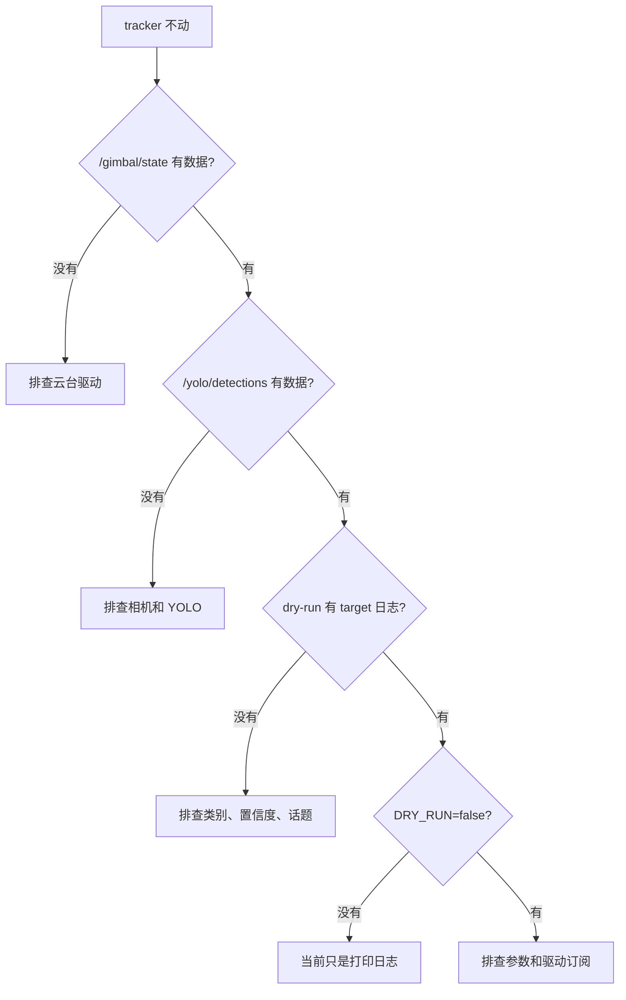

# DM-H3510 和 YOLO 跟踪排错

先定位是哪一层断了。不要直接改代码。

## 快速定位



## ADB 不在线

检查：

```powershell
adb devices
```

如果没有设备，检查 USB 线、开发板供电和 ADB 权限。

## 构建失败

执行：

```powershell
adb shell "bash /home/lckfb/workspace/dm_h3510_ros_ws/scripts/board/build_cpp_ros.sh"
```

如果只看到：

```text
Clock skew detected
```

通常是板端时间不准。先看最终是否有：

```text
Summary: 2 packages finished
```

如果没有这个 summary，再看真正的编译错误。

## 没有 `/gimbal/state`

检查话题：

```powershell
adb shell "source /opt/ros/jazzy/setup.bash && source /home/lckfb/workspace/dm_h3510_ros_ws/cpp/install/setup.bash && ros2 topic list"
```

检查驱动进程：

```powershell
adb shell "ps -ef | grep -E 'dm_h3510_ros_cpp|ros2' | grep -v grep"
```

启动 C++ 驱动：

```powershell
adb shell "bash /home/lckfb/workspace/dm_h3510_ros_ws/scripts/board/run_cpp_ros.sh"
```

如果话题存在但没有数据，优先检查 USB2CANFD、云台供电、CAN 线和电机反馈。

## 没有 `/yolo/detections`

检查话题：

```powershell
adb shell "source /opt/ros/jazzy/setup.bash && ros2 topic list | grep yolo"
```

检查 YOLO 进程：

```powershell
adb shell "ps -ef | grep -E 'drone_yolo|camera_web' | grep -v grep"
```

确认画面里有无人机。没有检测框时，tracker 不会输出目标。

## dry-run 没有 target 日志

启动 dry-run：

```powershell
adb shell "DRY_RUN=true bash /home/lckfb/workspace/dm_h3510_ros_ws/scripts/board/run_gimbal_tracker.sh"
```

如果只看到：

```text
未找到满足条件的目标，保持当前角度
```

检查 `target_class` 和 YOLO 输出类别是否一致。

查看参数：

```powershell
adb shell "cat /home/lckfb/workspace/dm_h3510_ros_ws/cpp/install/gimbal_tracker/share/gimbal_tracker/config/gimbal_tracker.yaml"
```

如果置信度太高，把 `min_confidence` 从 `0.60` 临时调低到 `0.40`。

## tracker 启动但云台不动

先确认是否还在 dry-run：

```text
dry_run=true
```

真实控制需要：

```powershell
adb shell "DRY_RUN=false bash /home/lckfb/workspace/dm_h3510_ros_ws/scripts/board/run_gimbal_tracker.sh"
```

再检查 `/gimbal/target_joint_state` 是否有发布：

```powershell
adb shell "source /opt/ros/jazzy/setup.bash && source /home/lckfb/workspace/dm_h3510_ros_ws/cpp/install/setup.bash && ros2 topic echo /gimbal/target_joint_state --once"
```

如果 target 有数据但电机不动，回到 `/gimbal/state` 和驱动层排查。

## 方向反了

现有逻辑：

```text
error_x = target_center_x - image_width / 2
delta_yaw = -kp_x * error_x
```

当前配置 `kp_x` 是负数。

目标在画面右侧时，`error_x` 是正数，`delta_yaw` 是正数。

如果实际方向反了，需要修改控制方向。不要只靠增大参数解决。

## 中心附近抖动

优先增大：

```yaml
deadband_px: 50.0
```

如果仍抖，再降低：

```yaml
kp_x: 0.0006
max_step_rad: 0.02
```

## 跟踪太慢

优先增大单次步进：

```yaml
max_step_rad: 0.05
```

如果仍慢，再小幅增大比例：

```yaml
kp_x: 0.0010
```

最后再调速度：

```yaml
velocity_rad_s: 1.2
```

## 参数不生效

运行时读取的是 install 目录：

```text
/home/lckfb/workspace/dm_h3510_ros_ws/cpp/install/gimbal_tracker/share/gimbal_tracker/config/gimbal_tracker.yaml
```

改 Windows 源码后，必须执行：

```powershell
cd .\dm_h3510_ros_ws
.\scripts\windows\deploy_to_board.ps1
adb shell "bash /home/lckfb/workspace/dm_h3510_ros_ws/scripts/board/build_cpp_ros.sh"
```

确认安装配置：

```powershell
adb shell "cat /home/lckfb/workspace/dm_h3510_ros_ws/cpp/install/gimbal_tracker/share/gimbal_tracker/config/gimbal_tracker.yaml | grep -E 'min_yaw_rad|max_yaw_rad|velocity_rad_s|deadband_px|kp_x|max_step_rad|dry_run'"
```

## 角度看不懂

| 角度 | 弧度 |
| --- | --- |
| `90°` | `1.5708` |
| `180°` | `3.1416` |
| `360°` | `6.2832` |

当前：

```yaml
min_yaw_rad: -6.2832
max_yaw_rad: 6.2832
```

含义是 yaw 允许从零点向左或向右各转一圈。

如果使用 `35:1` 谐波减速器，ROS 话题仍然使用输出端角度。

```text
输出端 360° = 6.2832 rad
电机端 360° = 6.2832 * 35 = 219.912 rad
```

## 安全回退

停止 tracker 后，云台驱动仍会保持上一次目标。

要发一个回中目标：

```powershell
adb shell "bash /home/lckfb/workspace/dm_h3510_ros_ws/scripts/board/pub_position_once.sh 0.0 1.0"
```

确认云台状态：

```powershell
adb shell "source /opt/ros/jazzy/setup.bash && source /home/lckfb/workspace/dm_h3510_ros_ws/cpp/install/setup.bash && ros2 topic echo /gimbal/state --once"
```
