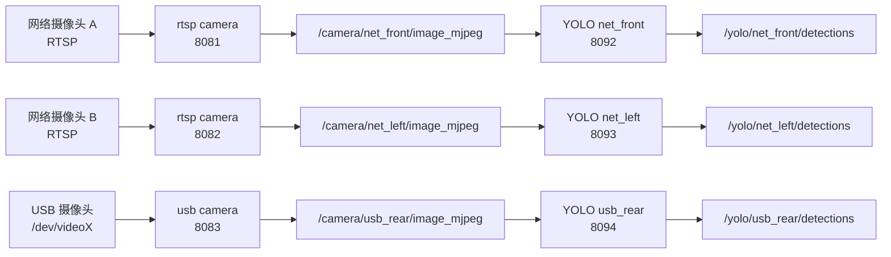
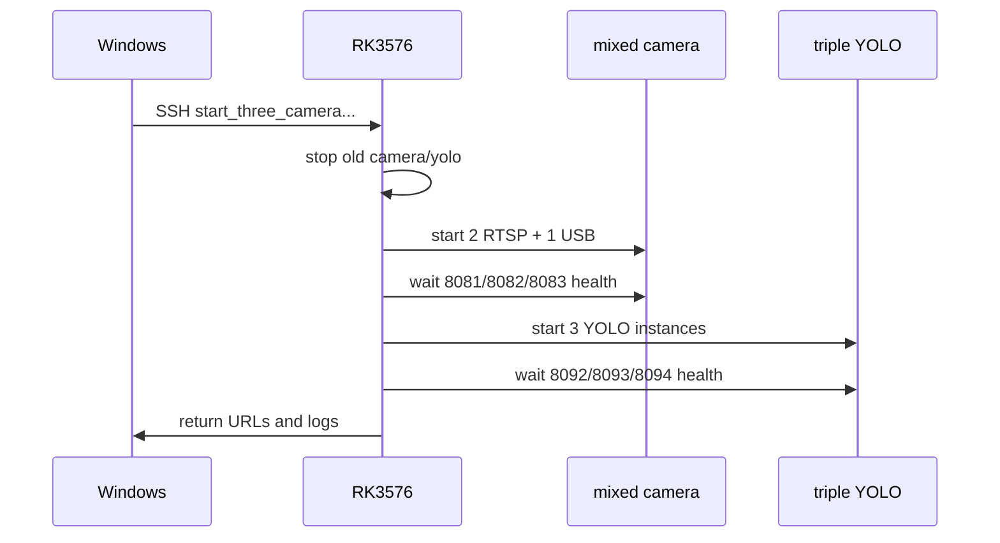

# RK3576 三路混合摄像头 YOLO 识别计划书

## 快速理解

当前 YOLO 识别一键链路只能直接跑 1 路摄像头。

你的目标是 2 个网络摄像头加 1 个 USB 摄像头。现有代码不能直接一键启动这 3 路并分别识别。推荐新增“三路混合输入编排”，默认使用自适应模式。接入几路，就启动几路 camera 和 YOLO。



## 5 分钟版

### 当前能用几路

| 层级 | 现有能力 | 结论 |
| --- | --- | --- |
| YOLO 识别链路 | 单路 USB 或单路 RTSP | 现成脚本一次只能识别 1 路 |
| 摄像头发布层 | 单路 USB、单路 RTSP、双路 USB | 已有组件可复用 |
| 三路混合输入 | 2 RTSP + 1 USB | 现有入口没有落地 |
| 自适应启动 | 1 到 3 路 | 推荐作为默认行为 |
| 严格三路校验 | 必须 3 路全在线 | 只作为演示前检查 |

### 为什么不能直接跑三路

`drone_yolo_web_cpp` 当前节点只创建一个图像订阅。它只维护一个检测快照、一个 HTTP 端口和一个检测输出话题。

现有完整链路脚本也只允许 `usb` 或 `rtsp` 二选一。它会启动一个摄像头服务，再启动一个 YOLO 服务。

### 推荐方向

第一版不要重写 YOLO 节点。按实际启用的摄像头数量启动 YOLO 节点实例。每一路使用独立 topic、端口和日志。

这样改动小，回退清楚，也方便逐路排查性能。

## 30 分钟版

### 现状证据

| 文件 | 证据 | 影响 |
| --- | --- | --- |
| `drone_yolo_web_cpp_ws/src/drone_yolo_web_cpp/launch/drone_yolo_web_cpp.launch.py` | 第 27-37 行只声明一个 `input_topic`、`port`、`camera_url`、`detections_topic` | 单个 launch 只启动一路 YOLO |
| `drone_yolo_web_cpp_ws/src/drone_yolo_web_cpp/src/yolo_overlay_node.cpp` | 第 59-69 行声明单路参数，第 77-82 行创建一个订阅和一个 publisher | 节点实例本身是单输入 |
| `drone_yolo_web_cpp_ws/scripts/board/start_drone_yolo_web_cpp.sh` | 第 20-27 行固定 `/camera/image_mjpeg`、`8092`、`/yolo/detections` | 板端 YOLO 启动脚本是单路 |
| `drone_yolo_web_cpp_ws/scripts/board/start_drone_yolo_cpp_all.sh` | 第 61-78 行选择 `usb` 或 `rtsp`，第 139-147 行只启动一组 camera + YOLO | 一键链路不是多路 |
| `camera_web_cpp_ws/src/camera_web_cpp/src/rtsp_mjpeg_publisher.cpp` | 第 37-44 行支持 `rtsp_url`、`topic`、`width`、`height`、`fps` | 网络摄像头组件可复用 |
| `camera_web_cpp_ws/src/camera_web_cpp/src/camera_mjpeg_publisher.cpp` | 第 50-57 行支持 `device`、`topic`、`frame_id`、`width`、`height`、`fps` | USB 摄像头组件可复用 |
| `camera_web_cpp_ws/src/camera_web_cpp/launch/multi_camera_web_cpp.launch.py` | 第 79-86 行只写了 `front` 和 `left` 两路 USB | 已有双路模板，但不是三路混合 |
| `camera_web_cpp_ws/src/camera_web_cpp/launch/rtsp_camera_web_cpp.launch.py` | 第 43 和 52 行固定 `/camera/image_mjpeg` | 单路 RTSP launch 不能直接复用为多路 |

### 目标命名

| 物理输入 | 逻辑名称 | 图像话题 | 摄像头端口 | YOLO 端口 | 检测话题 |
| --- | --- | --- | --- | --- | --- |
| 网络摄像头 A | `net_front` | `/camera/net_front/image_mjpeg` | `8081` | `8092` | `/yolo/net_front/detections` |
| 网络摄像头 B | `net_left` | `/camera/net_left/image_mjpeg` | `8082` | `8093` | `/yolo/net_left/detections` |
| USB 摄像头 | `usb_rear` | `/camera/usb_rear/image_mjpeg` | `8083` | `8094` | `/yolo/usb_rear/detections` |

### 总体架构

每一路分成两个服务。

第一层是摄像头发布层。网络摄像头使用 `RtspMjpegPublisher`。USB 摄像头使用 `CameraMjpegPublisher`。每一路再配一个 `CompressedMjpegServer`。

第二层是 YOLO 识别层。每一路启动一个 `drone_yolo_web_cpp_node`。它订阅对应图像话题，并在独立端口提供 `/detections` 和 `/health`。

### 关键约束

网络摄像头先按 RTSP 接入。若摄像头只提供 ONVIF 管理或 HTTP MJPEG，需要先确认实际视频 URL。

新脚本不要写死真实 RTSP 密码。密码用命令行参数或环境变量传入。

Windows 侧优先走 SSH 控制开发板。这样不依赖 ADB，也能减少 USB 调试口对 USB 摄像头链路的干扰。

单路旧入口必须保留。`8081 + 8092 + /yolo/detections` 仍作为回退链路。

默认启动模式是自适应。脚本只启动已启用且参数完整的摄像头。缺失的摄像头不启动 camera，不启动 YOLO，也不占用端口。

严格三路模式只用于演示前检查。启用严格模式时，任意一路缺失都直接失败，并输出缺失的逻辑名称。

### 自适应规则

| 现场输入 | 默认行为 | 端口占用 |
| --- | --- | --- |
| 只启用 `net_front` | 启动 1 路 RTSP camera + 1 路 YOLO | `8081`、`8092` |
| 启用 `net_front,net_left` | 启动 2 路 RTSP camera + 2 路 YOLO | `8081-8082`、`8092-8093` |
| 启用 `usb_rear` | 启动 1 路 USB camera + 1 路 YOLO | `8083`、`8094` |
| 三路全启用 | 启动完整 3 路 | `8081-8083`、`8092-8094` |
| 启用但参数缺失 | 跳过或失败，取决于 `--strict` | 自适应模式不占端口 |

## 实施计划

### 阶段 0：现场状态确认

目标是先证明三路输入都能独立出图。

检查项：

```bash
v4l2-ctl --list-devices
lsusb -t
ffprobe "rtsp://<user>:<password>@<camera-a>/stream"
ffprobe "rtsp://<user>:<password>@<camera-b>/stream"
ss -ltnp | grep -E '8081|8082|8083|8092|8093|8094'
```

验收标准：

| 项目 | 通过标准 |
| --- | --- |
| USB 摄像头 | 能确定稳定的 `/dev/videoX` |
| 网络摄像头 A | `ffprobe` 能读到分辨率和 FPS |
| 网络摄像头 B | `ffprobe` 能读到分辨率和 FPS |
| 端口 | `8081-8083` 和 `8092-8094` 未被占用 |

### 阶段 1：新增三路混合摄像头 launch

新增文件：

```text
camera_web_cpp_ws/src/camera_web_cpp/launch/mixed_camera_web_cpp.launch.py
```

职责：

| 组件 | 使用插件 | 关键参数 |
| --- | --- | --- |
| `net_front` | `camera_web_cpp::RtspMjpegPublisher` | `rtsp_url`、`topic`、`frame_id` |
| `net_left` | `camera_web_cpp::RtspMjpegPublisher` | `rtsp_url`、`topic`、`frame_id` |
| `usb_rear` | `camera_web_cpp::CameraMjpegPublisher` | `device`、`topic`、`frame_id` |
| 三个 Web 服务 | `camera_web_cpp::CompressedMjpegServer` | `image_topic`、`port` |

不需要修改 C++ 核心代码。`CMakeLists.txt` 已安装整个 `launch` 目录。

### 阶段 2：新增板端三路摄像头脚本

新增文件：

```text
camera_web_cpp_ws/start_mixed_camera_web_cpp.sh
camera_web_cpp_ws/stop_mixed_camera_web_cpp.sh
```

启动脚本参数：

| 参数 | 说明 |
| --- | --- |
| `--enable` | 逗号分隔启用列表，例如 `net_front,usb_rear` |
| `--strict` | 要求启用列表内所有摄像头都必须启动成功 |
| `--net-front-rtsp-url` | 网络摄像头 A RTSP 地址 |
| `--net-left-rtsp-url` | 网络摄像头 B RTSP 地址 |
| `--usb-device` | USB 摄像头设备路径 |
| `--net-size` | 网络摄像头输出尺寸 |
| `--usb-size` | USB 摄像头输出尺寸 |
| `--fps` | 目标 FPS |

验收命令：

```bash
curl http://127.0.0.1:8081/health
curl http://127.0.0.1:8082/health
curl http://127.0.0.1:8083/health
ros2 topic hz /camera/net_front/image_mjpeg
ros2 topic hz /camera/net_left/image_mjpeg
ros2 topic hz /camera/usb_rear/image_mjpeg
```

### 阶段 3：新增三路 YOLO launch

新增文件：

```text
drone_yolo_web_cpp_ws/src/drone_yolo_web_cpp/launch/triple_drone_yolo_web_cpp.launch.py
```

职责是按启用列表启动 1 到 3 个 `drone_yolo_web_cpp_node` 实例。

| 实例名 | 输入话题 | `camera_url` | YOLO 端口 | 检测话题 |
| --- | --- | --- | --- | --- |
| `drone_yolo_net_front` | `/camera/net_front/image_mjpeg` | `http://127.0.0.1:8081/stream.mjpg` | `8092` | `/yolo/net_front/detections` |
| `drone_yolo_net_left` | `/camera/net_left/image_mjpeg` | `http://127.0.0.1:8082/stream.mjpg` | `8093` | `/yolo/net_left/detections` |
| `drone_yolo_usb_rear` | `/camera/usb_rear/image_mjpeg` | `http://127.0.0.1:8083/stream.mjpg` | `8094` | `/yolo/usb_rear/detections` |

不建议第一版改成一个节点订阅三个 topic。那会增加线程、锁和错误隔离成本。

如果某一路未启用，则不创建对应 YOLO 节点。不要让 YOLO 节点订阅一个不会出帧的话题。

### 阶段 4：新增完整链路脚本

新增文件：

```text
drone_yolo_web_cpp_ws/scripts/board/start_three_camera_drone_yolo_cpp_all.sh
drone_yolo_web_cpp_ws/scripts/board/stop_three_camera_drone_yolo_cpp_all.sh
drone_yolo_web_cpp_ws/scripts/windows/start_three_camera_drone_yolo_cpp_all.ps1
drone_yolo_web_cpp_ws/scripts/windows/stop_three_camera_drone_yolo_cpp_all.ps1
```

启动顺序：



Windows 脚本默认直接访问开发板 IP：

```powershell
powershell -ExecutionPolicy Bypass -File .\drone_yolo_web_cpp_ws\scripts\windows\start_three_camera_drone_yolo_cpp_all.ps1 `
  -HostName 192.168.137.217 `
  -EnabledCameras net_front,net_left,usb_rear `
  -NetFrontRtspUrl "rtsp://<user>:<password>@<camera-a>/stream" `
  -NetLeftRtspUrl "rtsp://<user>:<password>@<camera-b>/stream" `
  -UsbDevice "/dev/video73"
```

可选增加 `-ForwardToLocal`。它再映射 `8081-8083` 和 `8092-8094` 到本机。

### 阶段 5：文档和回退

需要更新：

```text
camera_web_cpp_ws/README.md
drone_yolo_web_cpp_ws/README.md
docs/workspace-map.md
```

必须保留：

```text
camera_web_cpp_ws/start_camera_web_cpp.sh
camera_web_cpp_ws/start_rtsp_camera_web_cpp.sh
drone_yolo_web_cpp_ws/scripts/board/start_drone_yolo_cpp_all.sh
drone_yolo_web_cpp_ws/scripts/windows/start_drone_yolo_cpp_all.ps1
```

回退命令：

```powershell
powershell -ExecutionPolicy Bypass -File .\drone_yolo_web_cpp_ws\scripts\windows\stop_three_camera_drone_yolo_cpp_all.ps1
powershell -ExecutionPolicy Bypass -File .\drone_yolo_web_cpp_ws\scripts\windows\start_drone_yolo_cpp_all.ps1
```

## 验证计划

### 自适应递增验证

| 步骤 | 动作 | 通过标准 |
| --- | --- | --- |
| 1 | 只启动网络摄像头 A + YOLO | `8081` 和 `8092` health 正常 |
| 2 | 加入网络摄像头 B + YOLO | `8082` 和 `8093` health 正常 |
| 3 | 加入 USB 摄像头 + YOLO | `8083` 和 `8094` health 正常 |
| 4 | 三路同时运行 10 分钟 | `frames` 持续增加，进程不退出 |
| 5 | 停止脚本 | 端口和进程无残留 |

### 缺路验证

| 场景 | 启动参数 | 通过标准 |
| --- | --- | --- |
| 只有 1 路网络摄像头 | `-EnabledCameras net_front` | 只检查 `8081/8092` |
| 只有 USB 摄像头 | `-EnabledCameras usb_rear` | 只检查 `8083/8094` |
| 只有 2 路摄像头 | `-EnabledCameras net_front,usb_rear` | 只检查启用的两组端口 |
| 严格三路但缺一路 | `-EnabledCameras net_front,net_left,usb_rear -Strict` | 启动失败并提示缺失路 |

### 必跑命令

开发板：

```bash
curl http://127.0.0.1:8081/health
curl http://127.0.0.1:8082/health
curl http://127.0.0.1:8083/health
curl http://127.0.0.1:8092/health
curl http://127.0.0.1:8093/health
curl http://127.0.0.1:8094/health
curl http://127.0.0.1:8092/detections
curl http://127.0.0.1:8093/detections
curl http://127.0.0.1:8094/detections
ros2 topic list | grep -E '/camera/.*/image_mjpeg|/yolo/.*/detections'
```

Windows：

```powershell
Invoke-WebRequest -UseBasicParsing http://192.168.137.217:8092/health
Invoke-WebRequest -UseBasicParsing http://192.168.137.217:8093/health
Invoke-WebRequest -UseBasicParsing http://192.168.137.217:8094/health
```

停止后：

```bash
ps -ef | grep -E 'camera_web_cpp|drone_yolo_web_cpp' | grep -v grep
ss -ltnp | grep -E '8081|8082|8083|8092|8093|8094'
```

## 风险和处理

| 风险 | 表现 | 处理 |
| --- | --- | --- |
| NPU 负载不足 | 三路 `result_fps` 明显下降 | 先降到 `640x480@15`，再逐路升参数 |
| RTSP 网络抖动 | 某一路 `age` 增大或断流 | 增加重连参数，先单独压测该摄像头 |
| USB 带宽不足 | `VIDIOC_STREAMON` 报带宽不足 | USB 摄像头降分辨率，检查 `lsusb -t` |
| 端口冲突 | health 访问到旧服务 | 启动前执行 stop 脚本并检查 `ss -ltnp` |
| 重名节点 | ROS 图中节点混乱 | 三个 YOLO launch 实例使用不同 `name` |
| RTSP 密码泄露 | 地址进入 git diff | 脚本只接收参数，不写真实地址到仓库 |

## 里程碑

| 里程碑 | 产出 | 验收 |
| --- | --- | --- |
| M1 | 三路摄像头原始流 | `8081-8083` health 正常 |
| M2 | 三路 YOLO 识别 | `8092-8094` health 和 detections 正常 |
| M3 | Windows 自适应一键启动 | 一条 PowerShell 命令启动启用链路 |
| M4 | 一键关闭 | 进程、端口、转发无残留 |
| M5 | 文档同步 | README 和 workspace-map 可按图操作 |

## 结论

现在的 YOLO 识别现成链路只能直接使用 1 个摄像头。

2 个网络摄像头加 1 个 USB 摄像头的目标可做。第一版应采用自适应多实例方案。它不需要重写 RKNN 推理核心，只需要补齐混合 camera launch、YOLO 多实例 launch、板端脚本、Windows 脚本和验证文档。
