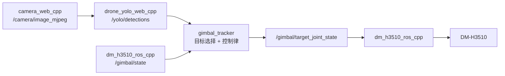
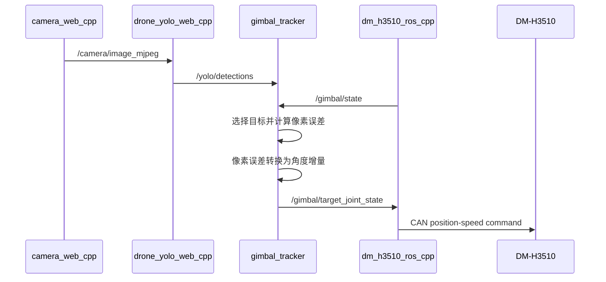
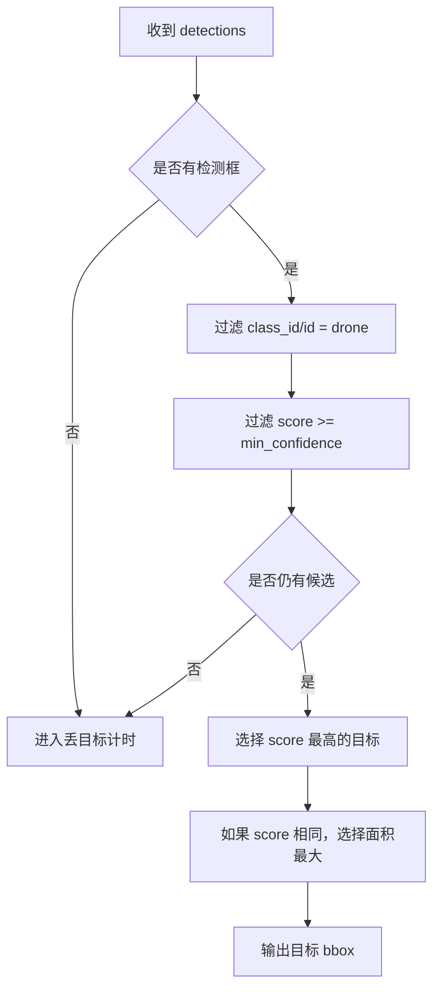

# RK3576 云台与 YOLO 联调计划书

## 快速理解

本次联调目标是让 YOLO 检测结果驱动 DM-H3510 云台转动。

推荐方案是新增一个独立 ROS2 跟踪控制节点。它订阅 `/yolo/detections` 和 `/gimbal/state`，计算目标相对画面中心的偏差，再发布 `/gimbal/target_joint_state`。

第一版只做单轴 yaw 跟踪。这样风险最低，也符合当前 DM-H3510 ROS2 驱动的单关节接口。



## 一、项目现状

当前 workspace 主入口：

```text
.
```

现有视觉链路：

| 模块 | 路径 | 职责 |
| --- | --- | --- |
| 摄像头 | `camera_web_cpp_ws` | 采集 USB 摄像头，发布 MJPEG 图像 |
| 无人机 YOLO | `drone_yolo_web_cpp_ws` | RKNN 推理，发布检测框 |
| 云台驱动 | `dm_h3510_ros_ws` | 控制 DM-H3510，发布云台反馈 |

现有 ROS2 接口：

| 方向 | 话题 | 类型 | 说明 |
| --- | --- | --- | --- |
| 输入 | `/camera/image_mjpeg` | `sensor_msgs/msg/CompressedImage` | YOLO 输入图像 |
| 输出 | `/yolo/detections` | `vision_msgs/msg/Detection2DArray` | YOLO 检测框 |
| 输入 | `/gimbal/position_cmd` | `std_msgs/msg/Float32` | 云台目标位置，单位 rad |
| 输入 | `/gimbal/target_joint_state` | `sensor_msgs/msg/JointState` | 云台目标位置和速度 |
| 输出 | `/gimbal/state` | `sensor_msgs/msg/JointState` | 云台位置、速度、力矩反馈 |

## 二、建设目标

### 2.1 第一阶段目标

先完成安全闭环。

| 项目 | 目标 |
| --- | --- |
| 控制轴 | 只控制 yaw 单轴 |
| 目标来源 | `/yolo/detections` |
| 控制输出 | `/gimbal/target_joint_state` |
| 控制频率 | 10 Hz |
| 安全策略 | 死区、限幅、限速、丢目标保持 |
| 调试模式 | 支持只打印不发命令 |

### 2.2 第二阶段目标

在单轴稳定后再增强。

| 项目 | 目标 |
| --- | --- |
| 双轴控制 | 支持 yaw + pitch |
| 目标策略 | 支持置信度、面积、类别优先级 |
| 多路摄像头 | 支持 `/yolo/front/detections` 等命名空间 |
| 可视化 | 在 Web 页面显示跟踪目标和中心误差 |
| 参数调节 | 通过 YAML 调整增益和限幅 |

## 三、总体方案

### 3.1 新增联调节点

新增一个 ROS2 包或节点，建议命名为：

```text
gimbal_tracker
```

建议放置位置：

```text
.\dm_h3510_ros_ws
```

原因：该节点属于云台上层控制逻辑。它不应混入相机或 YOLO 包。

### 3.2 数据流



### 3.3 控制公式

第一版只用横向误差：

```text
error_x = bbox_center_x - image_width / 2
```

目标角度：

```text
target_yaw = current_yaw - kp_x * error_x
```

必须加限制：

```text
abs(error_x) < deadband_px       -> 不动
abs(delta_yaw) > max_step_rad    -> 截断
target_yaw 超出限位             -> 截断
目标丢失超过 timeout_s          -> 保持当前角度
```

> 注意：第一次实测时方向可能相反。必须先用调试模式确认方向。

## 四、参数设计

建议第一版参数：

| 参数 | 默认值 | 说明 |
| --- | --- | --- |
| `detections_topic` | `/yolo/detections` | YOLO 检测话题 |
| `gimbal_state_topic` | `/gimbal/state` | 云台反馈话题 |
| `target_joint_topic` | `/gimbal/target_joint_state` | 云台目标话题 |
| `target_class` | `drone` | 跟踪类别 |
| `min_confidence` | `0.60` | 最低置信度 |
| `image_width` | `640` | 图像宽度 |
| `image_height` | `480` | 图像高度 |
| `deadband_px` | `40` | 中心死区 |
| `kp_x` | `0.0008` | 横向比例系数 |
| `max_step_rad` | `0.03` | 单次最大角度变化 |
| `min_yaw_rad` | `-1.0` | 最小 yaw |
| `max_yaw_rad` | `1.0` | 最大 yaw |
| `velocity_rad_s` | `0.5` | 云台速度限制 |
| `control_rate_hz` | `10` | 控制频率 |
| `lost_timeout_s` | `0.5` | 丢目标超时 |
| `dry_run` | `true` | 只打印，不发命令 |

## 五、目标选择策略

第一版使用简单策略。



后续可替换为更稳定的策略：

| 策略 | 优点 | 缺点 |
| --- | --- | --- |
| 最高置信度 | 简单，首版可靠 | 目标切换会抖 |
| 最大面积 | 更偏向近处目标 | 可能误追近处干扰 |
| 最近上一目标 | 跟踪稳定 | 需要保存历史状态 |

## 六、实施步骤

### 阶段 1：现有链路确认

目标：确认相机、YOLO、云台都能单独工作。

执行：

```powershell
powershell -ExecutionPolicy Bypass -File .\drone_yolo_web_cpp_ws\scripts\windows\start_drone_yolo_cpp_all.ps1
```

验证摄像头：

```powershell
Invoke-WebRequest -UseBasicParsing http://127.0.0.1:8081/health
```

验证 YOLO：

```powershell
Invoke-WebRequest -UseBasicParsing http://127.0.0.1:8092/health
Invoke-WebRequest -UseBasicParsing http://127.0.0.1:8092/detections
```

验证 ROS 检测话题：

```powershell
adb shell "source /opt/ros/jazzy/setup.bash && source /home/lckfb/workspace/drone_yolo_web_cpp_ws/install/setup.bash && ros2 topic echo /yolo/detections --once"
```

验收：

```text
8081 health 正常。
8092 health 正常。
/yolo/detections 能输出 Detection2DArray。
```

### 阶段 2：云台驱动确认

目标：确认云台可手动控制。

启动云台驱动：

```powershell
adb shell "bash /home/lckfb/workspace/dm_h3510_ros_ws/scripts/board/run_cpp_ros.sh"
```

查看话题：

```powershell
adb shell "source /opt/ros/jazzy/setup.bash && source /home/lckfb/workspace/dm_h3510_ros_ws/cpp/install/setup.bash && ros2 topic list"
```

发送小角度命令：

```powershell
adb shell "bash /home/lckfb/workspace/dm_h3510_ros_ws/scripts/board/pub_position_once.sh 0.2 0.5"
```

查看反馈：

```powershell
adb shell "source /opt/ros/jazzy/setup.bash && source /home/lckfb/workspace/dm_h3510_ros_ws/cpp/install/setup.bash && ros2 topic echo /gimbal/state --once"
```

验收：

```text
云台能低速转动。
/gimbal/state 有位置反馈。
/gimbal/target_joint_state 有订阅者。
```

### 阶段 3：新增跟踪节点

目标：新增 `gimbal_tracker`。

建议文件：

| 文件 | 作用 |
| --- | --- |
| `dm_h3510_ros_ws/cpp/src/gimbal_tracker/package.xml` | ROS2 包描述 |
| `dm_h3510_ros_ws/cpp/src/gimbal_tracker/CMakeLists.txt` | C++ 构建配置 |
| `dm_h3510_ros_ws/cpp/src/gimbal_tracker/src/gimbal_tracker_node.cpp` | 跟踪控制节点 |
| `dm_h3510_ros_ws/cpp/src/gimbal_tracker/launch/gimbal_tracker.launch.py` | 启动文件 |
| `dm_h3510_ros_ws/cpp/src/gimbal_tracker/config/gimbal_tracker.yaml` | 参数文件 |

节点接口：

| 方向 | 话题 | 类型 |
| --- | --- | --- |
| 订阅 | `/yolo/detections` | `vision_msgs/msg/Detection2DArray` |
| 订阅 | `/gimbal/state` | `sensor_msgs/msg/JointState` |
| 发布 | `/gimbal/target_joint_state` | `sensor_msgs/msg/JointState` |

验收：

```text
colcon build 成功。
ros2 node list 能看到 /gimbal_tracker。
dry_run=true 时不会发布云台命令。
```

### 阶段 4：调试模式联调

目标：只计算，不驱动云台。

启动时设置：

```yaml
dry_run: true
```

观察日志：

```text
target_id=drone score=0.82 center=(420, 240) error_x=100 delta=-0.030 current=0.000 target=-0.030 dry_run=true
```

验收：

```text
目标在画面右侧时，error_x 为正。
目标在画面左侧时，error_x 为负。
delta_yaw 不超过 max_step_rad。
无目标时不输出新目标角度。
```

### 阶段 5：方向确认

目标：确认云台转动方向。

方法：

1. 把目标放在画面右侧。
2. 保持 `dry_run=true`。
3. 观察计算出的 `delta_yaw`。
4. 手动发布一个同方向的小角度。
5. 看目标是否向画面中心移动。

判断：

| 结果 | 处理 |
| --- | --- |
| 目标靠近中心 | 方向正确 |
| 目标远离中心 | 反转 `kp_x` 符号 |

验收：

```text
目标在右侧时，云台动作后目标应靠近中心。
目标在左侧时，云台动作后目标应靠近中心。
```

### 阶段 6：低速闭环

目标：开启真实发布，但保持低速。

建议参数：

```yaml
dry_run: false
kp_x: 0.0005
max_step_rad: 0.015
velocity_rad_s: 0.3
deadband_px: 50
control_rate_hz: 5
```

验收：

```text
云台不会快速甩动。
目标偏离中心时会缓慢回中。
目标进入死区后停止继续追。
丢目标后保持当前位置。
```

### 阶段 7：参数调优

目标：提高响应速度，同时避免抖动。

调参顺序：

1. 先调整 `deadband_px`。
2. 再调整 `kp_x`。
3. 再调整 `max_step_rad`。
4. 最后调整 `velocity_rad_s`。

建议范围：

| 参数 | 保守值 | 常用值 | 风险值 |
| --- | --- | --- | --- |
| `deadband_px` | `60` | `40` | `<20` |
| `kp_x` | `0.0005` | `0.0008` | `>0.0015` |
| `max_step_rad` | `0.015` | `0.03` | `>0.06` |
| `velocity_rad_s` | `0.3` | `0.5` | `>1.0` |

验收：

```text
目标能回到画面中心附近。
目标在中心附近不反复抖动。
云台动作没有明显过冲。
```

### 阶段 8：一键启动脚本

目标：把联调流程固化。

建议新增：

| 文件 | 作用 |
| --- | --- |
| `dm_h3510_ros_ws/scripts/board/start_yolo_gimbal_tracking.sh` | 板端启动全链路 |
| `dm_h3510_ros_ws/scripts/board/stop_yolo_gimbal_tracking.sh` | 板端关闭全链路 |
| `dm_h3510_ros_ws/scripts/windows/start_yolo_gimbal_tracking.ps1` | Windows 一键启动 |
| `dm_h3510_ros_ws/scripts/windows/stop_yolo_gimbal_tracking.ps1` | Windows 一键关闭 |

启动顺序：

```text
1. 停止旧 camera、YOLO、gimbal、tracker 进程。
2. 启动 camera_web_cpp。
3. 等待 8081 health 正常。
4. 启动 drone_yolo_web_cpp。
5. 等待 8092 health 正常。
6. 启动 dm_h3510_ros_cpp。
7. 等待 /gimbal/state 正常。
8. 启动 gimbal_tracker。
```

验收：

```text
一键启动后，8081、8092、/gimbal/state、/gimbal_tracker 均正常。
一键关闭后，无相关进程残留。
```

## 七、人工测试计划

### 7.1 静态目标测试

| 步骤 | 预期 |
| --- | --- |
| 目标放画面左侧 | 云台向目标方向低速转动 |
| 目标放画面右侧 | 云台向目标方向低速转动 |
| 目标放画面中心 | 云台不再继续转动 |
| 移走目标 | 云台保持当前位置 |

### 7.2 动态目标测试

| 步骤 | 预期 |
| --- | --- |
| 慢速横向移动目标 | 云台平滑跟随 |
| 快速移出画面 | 云台不乱转 |
| 多个目标出现 | 跟踪置信度最高目标 |
| 目标短暂丢失 | 不立刻大幅动作 |

### 7.3 异常测试

| 异常 | 预期 |
| --- | --- |
| YOLO 无检测 | 不发布新角度 |
| `/gimbal/state` 中断 | 停止发布目标 |
| 检测框坐标异常 | 忽略该帧 |
| 云台超过限位 | 截断到安全范围 |
| 端口或进程残留 | 启动脚本先清理 |

## 八、验收标准

第一阶段完成时应满足：

1. 相机和 YOLO 原链路不受影响。
2. 云台驱动原手动控制不受影响。
3. `gimbal_tracker` 能读取 YOLO 检测框。
4. `gimbal_tracker` 能读取云台当前位置。
5. `dry_run=true` 时只打印，不驱动云台。
6. `dry_run=false` 时能低速追踪目标。
7. 目标进入中心死区后不抖动。
8. 丢目标后不继续盲目转动。
9. 启动和关闭脚本能清理相关进程。

## 九、风险与保护

### 9.1 方向反了

现象：

```text
目标越追越偏。
```

处理：

```text
立即停止 tracker。
反转 kp_x 符号。
重新用 dry_run 验证。
```

### 9.2 增益过大

现象：

```text
云台抖动或来回过冲。
```

处理：

```text
降低 kp_x。
增大 deadband_px。
降低 max_step_rad。
降低 velocity_rad_s。
```

### 9.3 目标误检

现象：

```text
云台追错目标。
```

处理：

```text
提高 min_confidence。
限制 target_class。
后续加入上一目标连续性判断。
```

### 9.4 云台反馈中断

现象：

```text
/gimbal/state 没有更新。
```

处理：

```text
tracker 停止发布目标。
检查 USB2CANFD。
检查 dm_h3510_ros_cpp 进程。
```

### 9.5 硬件安全

要求：

```text
首次闭环必须低速。
首次闭环必须有人看着云台。
首次闭环必须保留停止脚本。
不要直接使用大角度和高速度。
```

## 十、推荐执行顺序

```text
1. 启动 camera_web_cpp，确认 8081 health。
2. 启动 drone_yolo_web_cpp，确认 8092 health。
3. 确认 /yolo/detections 有检测框。
4. 启动 dm_h3510_ros_cpp，确认 /gimbal/state。
5. 手动发布 0.2 rad，确认云台能动。
6. 新增 gimbal_tracker 节点。
7. 用 dry_run=true 验证检测框到角度的计算。
8. 手动确认方向。
9. 用低增益打开 dry_run=false。
10. 逐步调参。
11. 固化一键启动和关闭脚本。
12. 更新 README 和排错说明。
```

## 十一、后续增强方向

单轴闭环稳定后，再做以下增强：

| 方向 | 内容 |
| --- | --- |
| 双轴控制 | 增加 pitch 轴控制 |
| 多目标稳定 | 增加目标 ID 或历史匹配 |
| 多摄像头 | 支持 front、left、right 检测话题 |
| Web 可视化 | 显示中心点、误差、目标状态 |
| 自动巡航 | 丢目标后按预设范围搜索 |
| 参数面板 | 支持运行时调节 PID 和限幅 |

## 十二、下一步建议

下一步先进入实现规划。

建议优先做最小版本：

```text
只新增 gimbal_tracker。
只订阅 /yolo/detections。
只控制 yaw。
默认 dry_run=true。
先不写一键脚本。
```

这个版本能最快验证核心闭环是否成立。
