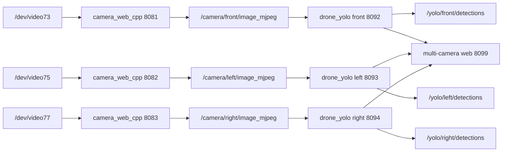
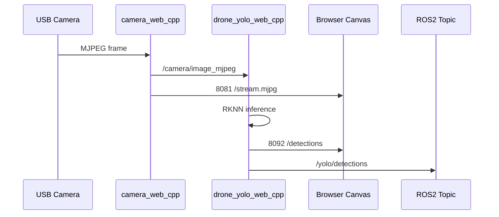

# RK3576 多摄像头无人机识别计划书

## 快速理解

当前工程已经具备单摄像头无人机识别链路。下一步目标是把它扩展为多摄像头链路。

推荐方案是“多实例独立运行”。每个摄像头对应一组独立话题、端口和 YOLO 节点。这样能最大限度复用现有 C++ 摄像头和 RKNN 推理代码。



## 一、项目背景

### 1.1 当前工程现状

当前 RK3576 工程主入口位于：

```text
.
```

无人机识别主链路位于：

```text
.\drone_yolo_web_cpp_ws
```

摄像头主链路位于：

```text
.\camera_web_cpp_ws
```

当前单路数据流如下：



### 1.2 单路限制

| 位置 | 当前限制 | 多路影响 |
| --- | --- | --- |
| `camera_web_cpp.launch.py` | 固定一个摄像头设备 | 多设备需要多个实例 |
| `CameraMjpegPublisher` | 一个节点打开一个 V4L2 设备 | 代码可复用，启动方式需扩展 |
| `CompressedMjpegServer` | 一个端口展示一路 MJPEG | 多路需要多个端口 |
| `drone_yolo_web_cpp.launch.py` | 只启动一个 YOLO 节点 | 多路需要多个节点 |
| `DroneYoloOverlayNode` | 一个订阅和一个检测快照 | 多路需要多实例或管理器 |
| `/yolo/detections` | 单路检测话题 | 多路会混在一起 |
| Windows 启动脚本 | 只转发 `8081` 和 `8092` | 多路需要端口矩阵 |

## 二、建设目标

### 2.1 总目标

在 RK3576 开发板上运行多个摄像头输入，并对每一路画面执行无人机识别。

每一路需要独立输出：

- 原始 MJPEG 视频流。
- 无人机检测 JSON。
- ROS2 检测话题。
- 浏览器 Canvas 叠框页面。
- 健康检查和性能指标。

### 2.2 第一阶段目标

第一阶段先完成双摄像头版本。

| 摄像头 | 设备 | 摄像头端口 | YOLO 端口 | 图像话题 | 检测话题 |
| --- | --- | --- | --- | --- | --- |
| front | `/dev/video73` | `8081` | `8092` | `/camera/front/image_mjpeg` | `/yolo/front/detections` |
| left | `/dev/video75` | `8082` | `8093` | `/camera/left/image_mjpeg` | `/yolo/left/detections` |

### 2.3 第二阶段目标

第二阶段扩展到三路或四路摄像头。

| 摄像头 | 建议设备 | 摄像头端口 | YOLO 端口 | 图像话题 | 检测话题 |
| --- | --- | --- | --- | --- | --- |
| front | `/dev/video73` | `8081` | `8092` | `/camera/front/image_mjpeg` | `/yolo/front/detections` |
| left | `/dev/video75` | `8082` | `8093` | `/camera/left/image_mjpeg` | `/yolo/left/detections` |
| right | `/dev/video77` | `8083` | `8094` | `/camera/right/image_mjpeg` | `/yolo/right/detections` |
| rear | `/dev/video79` | `8084` | `8095` | `/camera/rear/image_mjpeg` | `/yolo/rear/detections` |

> 设备号必须以开发板实际 `v4l2-ctl --list-devices` 输出为准。

## 三、总体方案

### 3.1 推荐架构

采用“多摄像头多进程实例”方案。

每一路摄像头运行一组服务：

```text
camera_web_cpp instance
drone_yolo_web_cpp instance
```

每一路绑定独立设备、话题和端口。

### 3.2 推荐理由

| 维度 | 结论 |
| --- | --- |
| 改动范围 | 小。现有摄像头和 YOLO 核心代码基本复用 |
| 排错难度 | 低。每路可单独查看 health 和 log |
| 性能观测 | 清楚。每路有独立 FPS、延迟和检测结果 |
| 风险控制 | 好。保留单路链路作为回退方案 |
| 扩展能力 | 中等。适合 2 到 4 路摄像头 |

### 3.3 不推荐方案

| 方案 | 不推荐原因 |
| --- | --- |
| 单进程内管理所有摄像头和 YOLO | 改动大，线程和锁复杂，首版风险高 |
| 多摄像头拼接成一张图再推理 | 坐标映射复杂，单帧分辨率增大，NPU 延迟会升高 |
| 所有检测继续发布到 `/yolo/detections` | 下游无法区分摄像头来源 |

## 四、技术设计

### 4.1 摄像头服务设计

`camera_web_cpp_ws` 继续负责低开销 MJPEG 采集。

每路摄像头使用独立参数：

| 参数 | front 示例 | left 示例 |
| --- | --- | --- |
| `device` | `/dev/video73` | `/dev/video75` |
| `topic` | `/camera/front/image_mjpeg` | `/camera/left/image_mjpeg` |
| `frame_id` | `camera_front` | `camera_left` |
| `port` | `8081` | `8082` |
| `width` | `640` | `640` |
| `height` | `480` | `480` |
| `fps` | `25` | `25` |

### 4.2 YOLO 服务设计

`drone_yolo_web_cpp_ws` 继续负责 RKNN 推理和 Canvas 叠框。

每路 YOLO 使用独立参数：

| 参数 | front 示例 | left 示例 |
| --- | --- | --- |
| `input_topic` | `/camera/front/image_mjpeg` | `/camera/left/image_mjpeg` |
| `detections_topic` | `/yolo/front/detections` | `/yolo/left/detections` |
| `port` | `8092` | `8093` |
| `camera_url` | `http://127.0.0.1:8081/stream.mjpg` | `http://127.0.0.1:8082/stream.mjpg` |
| `model_path` | `models/yolo11n.rknn` | `models/yolo11n.rknn` |
| `labels` | `drone` | `drone` |

### 4.3 汇总页面设计

新增一个多路汇总页面。

页面职责：

- 显示多路视频宫格。
- 每路叠加对应检测框。
- 每路显示独立 FPS、延迟和检测数量。
- 某一路异常时只标记该路异常。
- 不阻塞其他摄像头显示。

建议端口：

```text
8099
```

### 4.4 ROS2 话题设计

多路模式不再让所有节点发布到同一个 `/yolo/detections`。

推荐话题如下：

| 用途 | 话题 |
| --- | --- |
| front 检测 | `/yolo/front/detections` |
| left 检测 | `/yolo/left/detections` |
| right 检测 | `/yolo/right/detections` |
| rear 检测 | `/yolo/rear/detections` |
| 聚合目标 | `/yolo/target` |

`/yolo/target` 只在需要云台联动时新增。第一阶段不强制实现。

## 五、实施范围

### 5.1 需要新增的文件

| 文件 | 作用 |
| --- | --- |
| `drone_yolo_web_cpp_ws/scripts/board/start_multi_drone_yolo_cpp.sh` | 板端多路启动入口 |
| `drone_yolo_web_cpp_ws/scripts/board/stop_multi_drone_yolo_cpp.sh` | 板端多路关闭入口 |
| `drone_yolo_web_cpp_ws/scripts/windows/start_multi_drone_yolo_cpp_all.ps1` | Windows 多路一键启动 |
| `drone_yolo_web_cpp_ws/scripts/windows/stop_multi_drone_yolo_cpp_all.ps1` | Windows 多路一键关闭 |
| `drone_yolo_web_cpp_ws/src/drone_yolo_web_cpp/launch/multi_drone_yolo_web_cpp.launch.py` | 多 YOLO 节点 launch |
| `camera_web_cpp_ws/src/camera_web_cpp/launch/multi_camera_web_cpp.launch.py` | 多摄像头 launch |
| `drone_yolo_web_cpp_ws/src/drone_yolo_web_cpp/include/drone_yolo_web_cpp/multi_overlay_server.hpp` | 多路汇总页面接口 |
| `drone_yolo_web_cpp_ws/src/drone_yolo_web_cpp/src/multi_overlay_server.cpp` | 多路汇总页面实现 |

### 5.2 需要修改的文件

| 文件 | 修改内容 |
| --- | --- |
| `camera_web_cpp_ws/src/camera_web_cpp/CMakeLists.txt` | 安装新增 launch |
| `drone_yolo_web_cpp_ws/src/drone_yolo_web_cpp/CMakeLists.txt` | 编译并安装汇总服务 |
| `drone_yolo_web_cpp_ws/README.md` | 增加多路启动说明 |
| `drone_yolo_web_cpp_ws/src/drone_yolo_web_cpp/README.md` | 增加多路话题和端口说明 |
| `docs/workspace-map.md` | 增加多摄像头入口说明 |

### 5.3 不纳入第一阶段的内容

| 内容 | 原因 |
| --- | --- |
| 云台自动跟踪 | 需要目标选择策略，先等多路识别稳定 |
| 多目标跨摄像头融合 | 需要标定和坐标统一 |
| 摄像头外参标定 | 不影响第一阶段检测链路 |
| 模型重新训练 | 当前目标是多路运行，不是提升模型精度 |
| 数据集整理 | 与多路实时运行无直接关系 |

## 六、实施步骤

### 阶段 1：硬件确认

目标：确认开发板能稳定识别多个摄像头。

任务：

1. 执行 `v4l2-ctl --list-devices`。
2. 记录每个摄像头对应的 `/dev/video*`。
3. 执行 `v4l2-ctl --device=/dev/video73 --list-formats-ext`。
4. 确认每个设备支持 `MJPEG`。
5. 确认 `640x480@25` 可稳定采集。
6. 如需高清，再确认 `1280x720@30`。

验收：

```text
至少两个摄像头可以同时输出 MJPEG。
每路 health 的 frames 都持续增长。
```

### 阶段 2：双路摄像头启动

目标：先让两路摄像头原始流同时运行。

任务：

1. 新增 `multi_camera_web_cpp.launch.py`。
2. 启动 front 摄像头到 `8081`。
3. 启动 left 摄像头到 `8082`。
4. 分别发布 `/camera/front/image_mjpeg` 和 `/camera/left/image_mjpeg`。
5. 检查两个端口的 `/health`。
6. 检查两个 ROS2 图像话题。

验收：

```text
curl http://127.0.0.1:8081/health
curl http://127.0.0.1:8082/health
ros2 topic hz /camera/front/image_mjpeg
ros2 topic hz /camera/left/image_mjpeg
```

### 阶段 3：双路 YOLO 推理

目标：让两路图像同时进入 RKNN 无人机检测。

任务：

1. 新增 `multi_drone_yolo_web_cpp.launch.py`。
2. 启动 front YOLO 到 `8092`。
3. 启动 left YOLO 到 `8093`。
4. 发布 `/yolo/front/detections`。
5. 发布 `/yolo/left/detections`。
6. 检查两个 YOLO `/health`。
7. 检查两个 `/detections`。

验收：

```text
curl http://127.0.0.1:8092/health
curl http://127.0.0.1:8093/health
curl http://127.0.0.1:8092/detections
curl http://127.0.0.1:8093/detections
ros2 topic echo /yolo/front/detections --once
ros2 topic echo /yolo/left/detections --once
```

### 阶段 4：Windows 一键脚本

目标：从 Windows 一键启动和关闭多路链路。

任务：

1. 新增 `start_multi_drone_yolo_cpp_all.ps1`。
2. 新增 `stop_multi_drone_yolo_cpp_all.ps1`。
3. 启动脚本通过 ADB 调用板端多路脚本。
4. 自动转发 `8081`、`8082`、`8092`、`8093`、`8099`。
5. 启动后检查每路 health。
6. 关闭后移除所有 ADB forward。

验收：

```powershell
adb forward --list
powershell -ExecutionPolicy Bypass -File .\drone_yolo_web_cpp_ws\scripts\windows\start_multi_drone_yolo_cpp_all.ps1
powershell -ExecutionPolicy Bypass -File .\drone_yolo_web_cpp_ws\scripts\windows\stop_multi_drone_yolo_cpp_all.ps1
```

### 阶段 5：汇总页面

目标：用一个页面观察所有摄像头检测结果。

任务：

1. 新增多路汇总 HTTP 服务。
2. 页面使用宫格布局显示多路 ``。
3. 每路 Canvas 独立拉取对应 `/detections`。
4. 页面显示每路 FPS、延迟、检测数量。
5. 某一路请求失败时只标记该路。
6. 端口固定为 `8099`。

验收：

```text
http://127.0.0.1:8099/
```

页面应同时显示 front 和 left 两路视频。

### 阶段 6：三路或四路扩展

目标：在双路稳定后扩展更多摄像头。

任务：

1. 增加 right 摄像头配置。
2. 增加 rear 摄像头配置。
3. 增加 `8083`、`8084`、`8094`、`8095` 端口。
4. 增加对应 ROS2 话题。
5. 重新跑性能验证。

验收：

```text
所有启用摄像头 health 正常。
所有启用 YOLO health 正常。
汇总页面没有阻塞。
关闭脚本能清理全部进程和端口映射。
```

## 七、测试计划

### 7.1 构建测试

在板端执行：

```bash
cd /home/lckfb/workspace/ros/camera_web_cpp_ws
source /opt/ros/jazzy/setup.bash
colcon build --symlink-install --packages-select camera_web_cpp

cd /home/lckfb/workspace/drone_yolo_web_cpp_ws
source /opt/ros/jazzy/setup.bash
colcon build --symlink-install --packages-up-to drone_yolo_web_cpp
```

预期：

```text
两个工作区均构建成功。
无 CMake 安装文件缺失。
无 launch 文件安装缺失。
```

### 7.2 单路回归测试

保留原始单路命令：

```powershell
powershell -ExecutionPolicy Bypass -File .\drone_yolo_web_cpp_ws\scripts\windows\start_drone_yolo_cpp_all.ps1
```

预期：

```text
原 8081 和 8092 单路链路仍正常。
旧 /yolo/detections 仍可用于单路模式。
```

### 7.3 双路功能测试

启动双路：

```powershell
powershell -ExecutionPolicy Bypass -File .\drone_yolo_web_cpp_ws\scripts\windows\start_multi_drone_yolo_cpp_all.ps1
```

检查：

```powershell
Invoke-WebRequest -UseBasicParsing http://127.0.0.1:8081/health
Invoke-WebRequest -UseBasicParsing http://127.0.0.1:8082/health
Invoke-WebRequest -UseBasicParsing http://127.0.0.1:8092/health
Invoke-WebRequest -UseBasicParsing http://127.0.0.1:8093/health
adb forward --list
```

预期：

```text
四个 health 都返回 frames。
frames 随时间增长。
ADB 端口映射完整。
```

### 7.4 性能测试

记录每路：

| 指标 | 来源 | 合格标准 |
| --- | --- | --- |
| `result_fps` | `/detections` | 双路不低于可用交互帧率 |
| `last_pipeline_ms` | `/detections` | 不持续异常升高 |
| `last_inference_ms` | `/detections` | RKNN 推理时间稳定 |
| `age` | `/detections` | 不持续大于 1 秒 |
| 摄像头 frames | `/health` | 持续增长 |
| 进程状态 | `ps -ef` | 无重复残留 |

### 7.5 关闭测试

执行：

```powershell
powershell -ExecutionPolicy Bypass -File .\drone_yolo_web_cpp_ws\scripts\windows\stop_multi_drone_yolo_cpp_all.ps1
```

检查：

```powershell
adb forward --list
adb shell "ps -ef | grep -E 'drone_yolo|camera_web|yolo_overlay' | grep -v grep"
```

预期：

```text
多路摄像头和 YOLO 进程均已停止。
8081、8082、8092、8093、8099 映射已移除。
```

## 八、风险评估

### 8.1 USB 带宽风险

多路 MJPEG 摄像头会占用 USB 带宽。

应对：

- 第一阶段使用 `640x480@25`。
- 同时启动两路后再扩展第三路。
- 优先使用 MJPEG，不使用 YUYV。

### 8.2 NPU 排队风险

多个 YOLO 节点同时调用 RKNN，可能导致推理排队。

应对：

- 先测双路。
- 记录每路 `last_inference_ms`。
- 如果延迟过高，降低帧率。
- 必要时改成“轮询推理调度器”。

### 8.3 CPU 解码风险

YOLO 节点仍需 JPEG 解码。

应对：

- 摄像头节点不做解码和重编码。
- YOLO 节点只处理必要帧。
- 后续可增加推理限帧参数。

### 8.4 端口冲突风险

多路服务需要更多端口。

应对：

- 固定端口表。
- 启动前先停止旧进程。
- 启动失败时输出端口占用信息。

### 8.5 话题混淆风险

多路检测如果共用 `/yolo/detections`，下游无法区分来源。

应对：

- 多路模式使用命名空间话题。
- 单路模式保留旧话题用于兼容。

## 九、里程碑

| 阶段 | 产出 | 验收结果 |
| --- | --- | --- |
| M1 | 多摄像头设备表 | 明确每路 `/dev/video*` |
| M2 | 双路摄像头原始流 | `8081` 和 `8082` 正常 |
| M3 | 双路 YOLO 推理 | `8092` 和 `8093` 正常 |
| M4 | Windows 一键脚本 | 一键启动和关闭正常 |
| M5 | 汇总页面 | `8099` 多宫格正常 |
| M6 | 三路或四路扩展 | 多路稳定性达标 |

## 十、验收标准

项目完成时应满足：

1. 至少两路摄像头同时运行。
2. 每路都有独立原始视频端口。
3. 每路都有独立 YOLO 检测端口。
4. 每路都有独立 ROS2 检测话题。
5. 汇总页面能同时显示所有启用摄像头。
6. 单路旧启动脚本不受影响。
7. 多路关闭脚本能清理全部进程。
8. 文档写清楚设备、端口、话题和排错方法。

## 十一、推荐执行顺序

```text
1. 确认多摄像头硬件设备号。
2. 新增双路 camera_web_cpp launch。
3. 验证两路原始 MJPEG。
4. 新增双路 drone_yolo launch。
5. 验证两路 YOLO detection。
6. 新增 Windows 一键启动和关闭脚本。
7. 新增 8099 汇总页面。
8. 更新 README 和 workspace-map。
9. 扩展三路或四路。
10. 做性能和关闭验证。
```

## 十二、后续增强方向

多路识别稳定后，再考虑：

- 增加推理限帧参数。
- 增加目标优先级选择。
- 输出 `/yolo/target` 聚合目标。
- 接入 DM-H3510 云台跟踪。
- 增加摄像头标定和方向配置。
- 增加跨摄像头目标去重。
